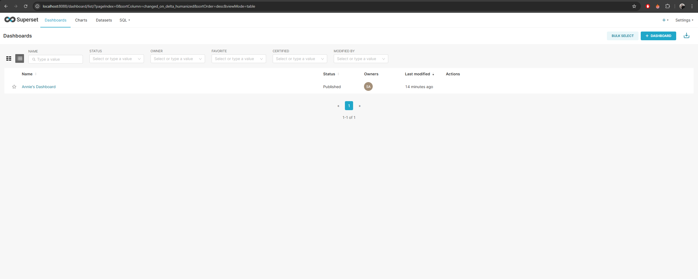
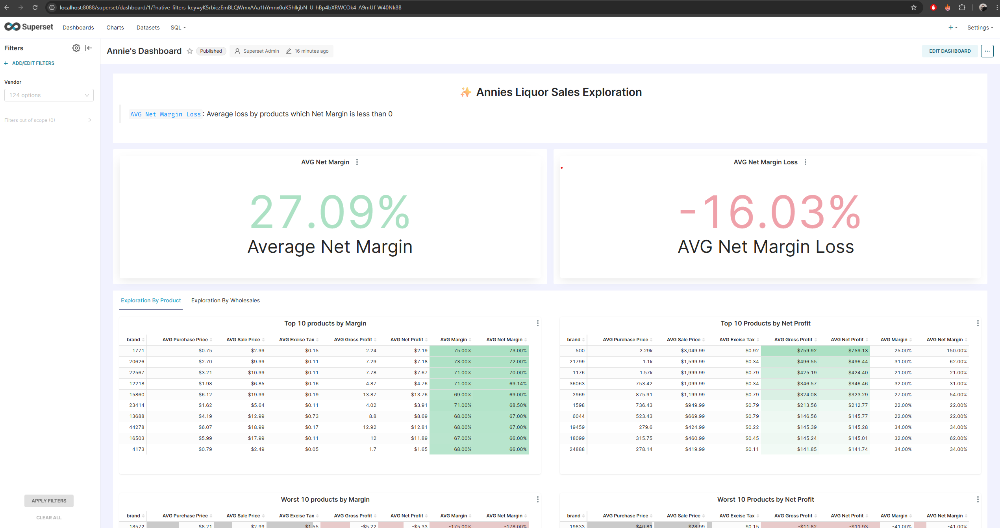

# Annie-s Magic Numbers Project


## Table of Contents
-   [Introduction](#introduction)
-   [Prerequisites](#prerequisites)
-   [Local Installation](#local-installation)
-   [Environment Variables](#environment-variables)
-   [API Documentation](#api-documentation)

## Introduction
Discovering hard to find truths

As Data Analyst/Engineers, we have to help Annie, the owner of a large liquor and spirit distributor in the US to understand her profits and margins. She provided us this link where we can download relevant CSV data:https://www.pwc.com/us/en/careers/university-relations/data-and-analytics-case-studies-files.html

## Prerequisites

-   Docker Desktop to build the service.

## Local Installation

1.  Clone the repository (first time step):

    ```sh
    git clone https://github.com/whipped-coffee/Annie-s-Magic-Numbers-DA-E.git
    cd Annie-s-Magic-Numbers-DA-E
    ```

> [!IMPORTANT]
> The following steps assume that you are located in the root of the cloned repository.


2.  The next step is to build up the service:
    ```bash 
    Annie-s-Magic-Numbers-DA-E> docker-compose -f docker/docker-compose.yml up --build -d
    ```

> [!IMPORTANT]
> For this step you must have Docker on your machine

3. The last step is to wait for the services to build and run (take into account that the load can last several minutes) and then enter the dashboard on:
localhost:8088
using the credentials:
* username: annie
* password: annieMagicWord





> [!IMPORTANT]
> If your dashboard, does not have the same data as the one in the pictures, take into account that we took a random sample of the sales

## Environment Variables

All envs used on services will be hard coded in the docker-compose for practical purposes
